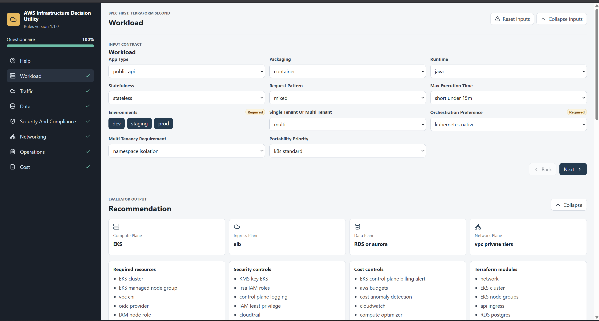
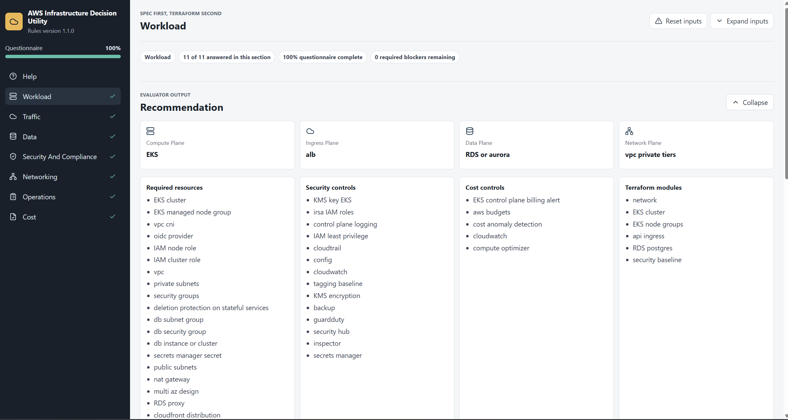
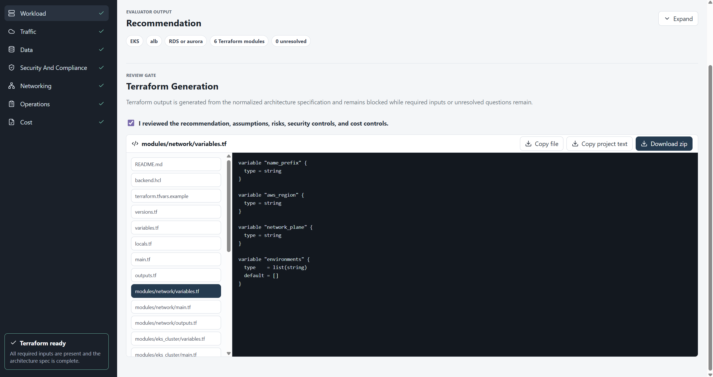

# AWS Infrastructure Decision Utility

## Project Description

The AWS Infrastructure Decision Utility is a web application that helps an end user translate business and technical workload intent into an AWS infrastructure recommendation before Terraform is generated.

The application follows a **spec first, Terraform second** workflow. It does not generate Terraform directly from raw form fields. Instead, it collects structured input, evaluates that input against a machine-readable AWS decision rules artifact, derives an intermediate architecture specification, presents the recommendation for review, and only then generates Terraform project files.

The project is intended for engineers, founders, cloud teams, platform engineers, and solutions architects who know what they need an application to do, but want guided assistance choosing AWS services, security controls, cost controls, and Terraform module boundaries.

## Application Behavior

### Workload And Questionnaire Flow

The user starts by completing a guided questionnaire. The questionnaire is driven by `decision_rules.json`, so the fields stay aligned with the rules engine rather than being hard-coded independently in the UI.

The left navigation separates the questionnaire into major decision areas:

- Workload
- Traffic
- Data
- Security and Compliance
- Networking
- Operations
- Cost

Fields marked as required are blocker inputs. Terraform generation remains blocked until those required values are provided and the evaluator has enough information to resolve the architecture.



### Evaluator Output And Recommendation

As the user answers the questionnaire, the evaluator applies the rules from `decision_rules.json` and produces a normalized recommendation.

The recommendation includes:

- Compute plane
- Ingress plane
- Data plane
- Network plane
- Required AWS resources
- Security controls
- Cost controls
- Terraform module boundaries
- Matched rule identifiers
- Assumptions
- Risks
- Unresolved questions

The recommendation section can be expanded for review or collapsed to reduce vertical scrolling when the user wants to focus on generated Terraform.



### Terraform Generation

Terraform generation is gated by the evaluator. Terraform output is available only when:

- the rules file validates against the schema
- blocker fields are complete
- unresolved questions are cleared
- the architecture has enough selected planes to support generation
- the user accepts the review gate

The Terraform generator produces a project-style file set rather than a single flat snippet. The generated files include root Terraform files and child modules such as `network`, `eks_cluster`, `eks_node_groups`, `api_ingress`, `rds_postgres`, `static_site`, `dynamodb_table`, and `security_baseline` when those modules are selected by the recommendation.

The Terraform panel provides:

- a vertical generated-file list
- a preview pane for the selected file
- copy current file
- copy full project text
- download Terraform project zip

The downloaded zip includes a parameterized `terraform.tfvars.example` and `backend.hcl` so end users can fill in project-specific values in one place.



## Application Help

The Help section explains how an end user should interact with the utility to successfully generate AWS Terraform.

It provides:

- a step-by-step workflow from questionnaire completion to Terraform generation
- explanation of why Terraform may be blocked
- a description of architecture planes
- guidance on matched rules
- review expectations for risks and assumptions
- guidance on when to copy or download Terraform
- a questionnaire reference that explains each input field
- option-level meanings for dropdown values such as `container`, `function`, `public_api`, `relational`, `kubernetes_native`, and other rule-driven choices

The Help content is intentionally centralized in the Help section rather than displayed inline under every questionnaire field, keeping the form compact while still giving users access to detailed guidance.

## Project Stack of Technology

This project is implemented as a local browser application using:

- React
- TypeScript
- Vite
- Ajv 2020 JSON Schema validation
- JSZip for Terraform project zip export
- Lucide React icons
- Playwright for browser verification during development

Core local artifacts:

- `decision_rules.json` - machine-readable AWS decision rules
- `rules.schema.json` - validation schema for the rules artifact
- `evaluator_contract.md` - expected evaluator behavior and output contract
- `current_infra_to_terraform_prompt.docx` - original implementation prompt
- `current_infra_to_terraform_prompt.md` - Markdown prompt companion

## How to Build & Run the Project

Install dependencies:

```bash
npm install
```

Run the development server on port `5175`:

```bash
npm run dev -- --port 5175
```

Open the application:

```text
http://127.0.0.1:5175/
```

Run the evaluator smoke test:

```bash
npm run test:evaluator
```

Build the production bundle:

```bash
npm run build
```

Preview a production build:

```bash
npm run preview
```

## Reference Materials Required to Understand the Project

The most important references are:

- `current_infra_to_terraform_prompt.docx` - original product and implementation prompt
- `current_infra_to_terraform_prompt.md` - readable Markdown version of the prompt
- `decision_rules.json` - operational source of truth for AWS recommendation logic
- `rules.schema.json` - schema used to validate the decision rules artifact
- `evaluator_contract.md` - contract for rule loading, blocker validation, rule evaluation, recommendation merging, and Terraform readiness

Supporting research PDFs are stored in `_Reference/`:

- `AWS Infrastructure Decision Utility for Terraform Generation.pdf`
- `Evaluating Amazon EKS for an AWS Infrastructure Decision Utility That Outputs Terraform.pdf`
- `Adding Amazon EKS to an AWS Infrastructure Decision Utility.pdf`

The PDF materials provide rationale and context. The implementation should treat `decision_rules.json` as the operational contract, `rules.schema.json` as the validation contract, and `evaluator_contract.md` as the runtime behavior contract.
