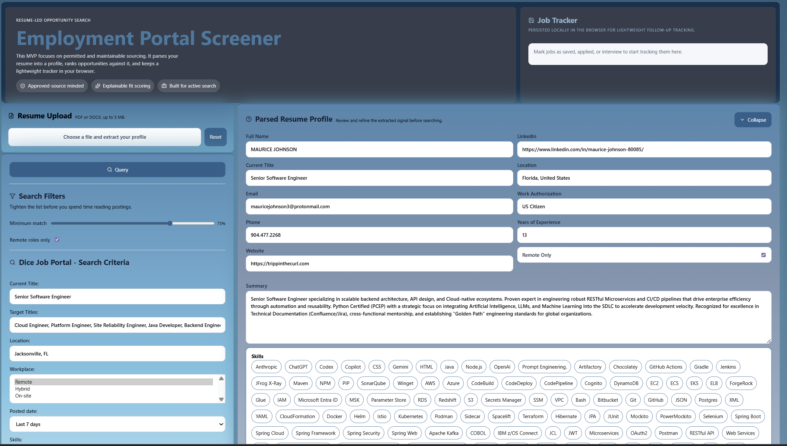
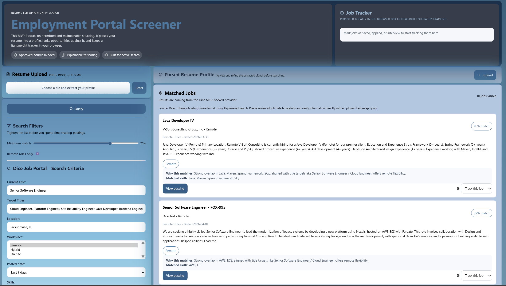

# Employment Portal Screener

Employment Portal Screener is a resume-led job search MVP. The application lets an end user upload a `PDF` or `DOCX` resume, extract a structured candidate profile from that document, refine the extracted signal in the UI, and then query a supported job provider to find matching opportunities.

The current implementation is designed to be practical and explainable. Instead of treating job matching as a black box, the app exposes the candidate profile that was parsed from the resume, lets the user adjust search criteria before querying, and scores returned jobs against the profile so the user can quickly focus on likely-fit roles.

## Application Functionality

At a high level, the application supports this workflow:

1. Upload a resume in `PDF` or `DOCX` format.
2. Parse the resume client-side into a structured candidate profile.
3. Review and refine the extracted resume data before searching.
4. Configure search criteria for the active job provider.
5. Run a query against that provider.
6. Review matched jobs and optionally track them locally in the browser.

The page layout is organized around that workflow:

- Left side: resume upload and search/filter controls
- Main content area: parsed resume profile and matched jobs
- Top tracker card: a lightweight local job tracker

After a resume is uploaded, the file is parsed locally in the browser and the extracted data populates the `Parsed Resume Profile` panel, as shown in `ParsedResumeProfile_Expanded`. The application does **not** automatically run a job query. The user can review the parsed data, adjust search inputs, and then click `Query` when ready.

The parsed resume profile includes fields such as:

- Full name
- Current title
- Email and contact details
- LinkedIn and location
- Work authorization
- Years of experience
- Resume summary
- Parsed skills

The `Parsed Resume Profile` panel is editable and collapsible. In its expanded state, shown in `ParsedResumeProfile_Expanded`, the user can inspect and refine the extracted data. After the profile looks correct, the panel can be collapsed, as shown in `ParsedResumeProfile_Collapsed`, so the user can focus on filtering and reviewing job postings.

The `Matched Jobs` panel shows ranked job results returned from the active provider. Jobs can also be marked with lightweight statuses such as `saved`, `interested`, `applied`, `interview`, or `rejected`. Tracker state is stored locally in browser storage.

Resume parsing is done client-side. The application extracts text from:

- `PDF` files using `pdfjs-dist`
- `DOCX` files using `mammoth`

That raw text is then processed into a structured candidate profile used for search criteria defaults, matching and scoring, and resume review and correction.

This parsing step is useful for more than job search convenience. It also acts as an ATS validation checkpoint. If job titles, key skills, summary content, or contact details are not being extracted cleanly, that can be an early signal that other automated systems may also struggle to interpret the resume correctly.





## Current Job Provider Integration

The application currently integrates with the Dice job portal through a backend provider layer.

Today, the backend:

- Accepts the parsed candidate profile from the frontend
- Builds provider-specific query inputs
- Queries Dice through its MCP-backed integration
- Aggregates returned results
- Normalizes those jobs into the app's internal shape
- Falls back to seeded demo jobs if Dice is unavailable

Dice is the first integrated provider, but the codebase is intentionally structured so additional providers can be added later. The goal is to expand beyond Dice over time as other stable and supportable provider APIs are identified.

## Technology Stack

### Frontend

- React 18
- TypeScript
- Vite
- `lucide-react` for icons
- `pdfjs-dist` for PDF parsing
- `mammoth` for DOCX parsing

### Backend

- Node.js
- Express
- TypeScript
- `@modelcontextprotocol/sdk` for the Dice MCP integration path

### Storage

- Browser `localStorage` for persisted candidate profile state
- Browser `localStorage` for job tracker state

## Project Structure

- [src/App.tsx](C:\ws_openai_codex\src\App.tsx): main application UI and state flow
- [src/lib/resumeParser.ts](C:\ws_openai_codex\src\lib\resumeParser.ts): resume extraction and profile parsing helpers
- [src/lib/matching.ts](C:\ws_openai_codex\src\lib\matching.ts): local scoring and filtering logic
- [src/lib/diceQuery.ts](C:\ws_openai_codex\src\lib\diceQuery.ts): Dice-oriented query construction helpers
- [server/index.ts](C:\ws_openai_codex\server\index.ts): Express API entry point
- [server/searchService.ts](C:\ws_openai_codex\server\searchService.ts): backend job search orchestration
- [server/providers/diceProvider.ts](C:\ws_openai_codex\server\providers\diceProvider.ts): Dice provider implementation

## Build The Application

Install dependencies:

```bash
npm install
```

Create a production build:

```bash
npm run build
```

This builds both:

- the Vite client
- the TypeScript server bundle

## Start The Application

For local development, run:

```bash
npm run dev
```

This starts:

- the frontend Vite dev server on `http://localhost:4321`
- the backend API on `http://localhost:8787`

The frontend proxies API traffic to the backend during development, so the normal development flow is to start both together with `npm run dev`, upload a resume, refine the parsed profile, and click `Query` to retrieve jobs.

## Current Notes

- Dice is the only live provider currently integrated.
- If Dice is unavailable or returns an unusable response, the backend falls back to seeded jobs so the UI remains usable.
- Resume parsing happens locally in the browser; there is no database-backed profile storage in the current MVP.
