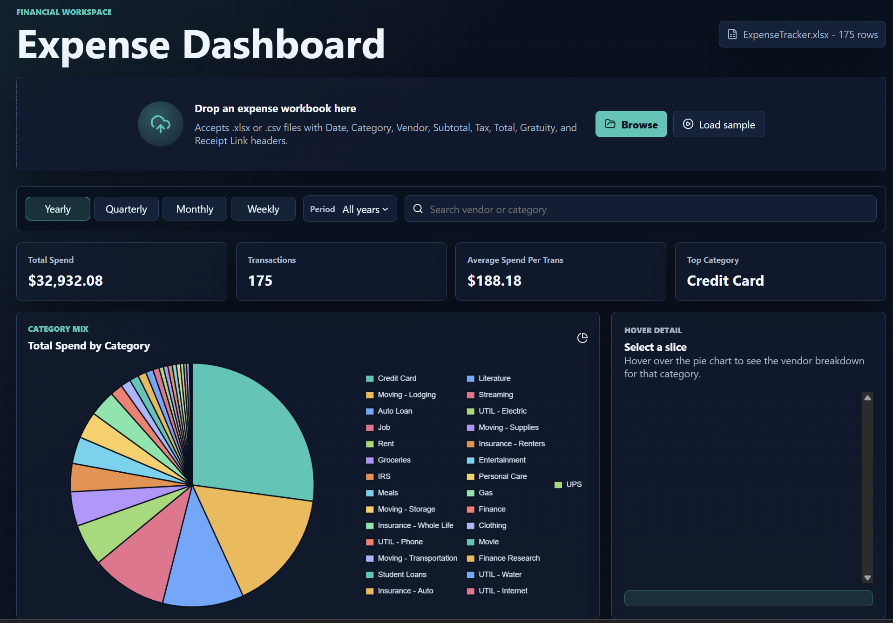

# Financial Expense Dashboard

## Project Description

Financial Expense Dashboard is a single-page browser application for reviewing expense data from `.xlsx` or `.csv` files. It parses a workbook with expense line items, summarizes spending patterns, and provides interactive filtering, tabular review, and category-level visualization.

The project was built from the requirements in `prompt.docx` and tested with the sample workbook at `input/ExpenseTracker.xlsx`.

## Application Behavior

The application starts with a compact upload panel where users can drag and drop an expense workbook, browse for a file, or load the included sample workbook. Supported files must include these headers:

- `Date`
- `Category`
- `Vendor`
- `Subtotal`
- `Tax`
- `Total`
- `Gratuity`
- `Receipt Link`

Once a file is loaded, the dashboard displays:

- KPI cards for total spend, transaction count, average spend per transaction, and top category.
- A filter bar for yearly, quarterly, monthly, and weekly grouping.
- A period selector that changes based on the selected grouping.
- A search field for filtering by vendor or category.
- A pie chart that aggregates total spend by category.
- A hover detail panel for pie-chart slices, including vendor breakdown and an overall total when multiple vendors exist.
- A month comparison panel for selecting two months and reviewing category-level spending differences.
- A striped transaction table with a dynamic grand total row.



The dashboard updates dynamically as users change the period filter or search input. The chart, KPIs, hover panel, table rows, and grand total all reflect the active filtered data.

The month comparison panel lets users choose a comparison month and a baseline month. It displays the total spend for each month, the overall difference, and a category table sorted by spending increase so users can quickly identify where expenses rose.

## Project Stack of Technology

- HTML5 for application structure.
- CSS3 for responsive layout and financial-dashboard styling.
- JavaScript for parsing, filtering, aggregation, and UI rendering.
- SheetJS `xlsx` for reading `.xlsx`, `.xls`, and `.csv` files in the browser.
- Chart.js for the interactive category pie chart.
- Lucide icons for interface iconography.

The application uses CDN-loaded browser libraries and does not require a package install step.

## How to Build & Run the Project

This is a static browser application, so there is no build step required.

From PowerShell:

```powershell
cd C:\ws_openai_ws\expense_dashboard
python -m http.server 4173 --bind 127.0.0.1
```

Then open:

```text
http://127.0.0.1:4173/
```

The app can also be opened directly from `index.html`, but running it through a local server is recommended because the **Load sample** button fetches `./input/ExpenseTracker.xlsx`.

## Reference Materials Required to Understand the Project

- `prompt.docx` - Original project prompt and functional requirements.
- `input/ExpenseTracker.xlsx` - Sample workbook used to validate parsing, filtering, totals, and chart behavior.
- `index.html` - Main page structure and dashboard markup.
- `styles.css` - Responsive layout, visual styling, and panel behavior.
- `app.js` - File parsing, date grouping, filtering, KPI calculations, chart rendering, month comparison, table rendering, and hover detail logic.
