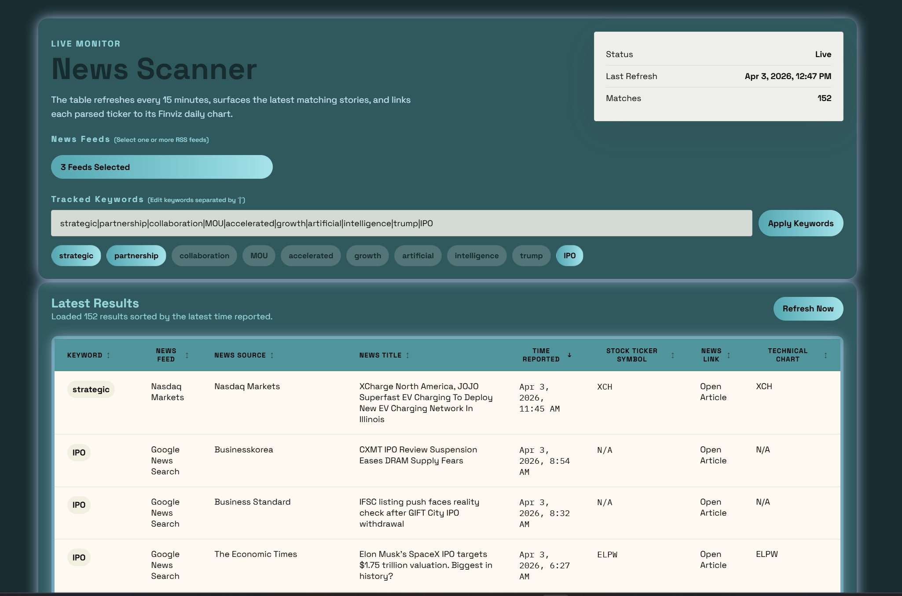

# News Scanner

News Scanner is a single-page market-news dashboard that aggregates RSS results across multiple news providers, filters stories by configurable keywords, and presents the matches in a sortable table with ticker symbols and Finviz chart links.



## Project Overview

The project is designed for quickly scanning live finance-related headlines that match themes you care about, such as `strategic`, `partnership`, `IPO`, `artificial`, or any custom keyword set you enter.

The app has two main parts:

- A Node.js and Express backend that pulls RSS feeds, normalizes articles, applies keyword matching, deduplicates overlapping stories, and performs best-effort ticker extraction.
- A lightweight browser-based frontend that lets you control feeds and keywords, then explore the results in a sortable table.

## What The App Can Do

- Query multiple RSS sources at once from a single dashboard.
- Default to `Google News Search` and `Nasdaq Markets`, with additional feeds available from the feed selector.
- Filter stories by editable keywords separated with `|`.
- Toggle individual keywords on and off using chips without rewriting the full keyword list.
- Combine matched stories from selected feeds into one normalized result set.
- Deduplicate repeated stories that appear across sources.
- Sort the table by:
  - `Keyword`
  - `News Feed`
  - `News Source`
  - `News Title`
  - `Time Reported`
  - `Stock Ticker Symbol`
  - `News Link`
  - `Technical Chart`
- Extract stock tickers when a headline or article metadata contains recognizable symbols.
- Build Finviz daily-chart links for detected tickers.
- Refresh automatically every 15 minutes.
- Refresh on demand with the `Refresh Now` button.

## Feed Sources

The app currently supports these feed providers:

- `Google News Search`
- `Nasdaq Markets`
- `Nasdaq IPOs`
- `SEC Press Releases`
- `Federal Reserve Press Releases`

Default selection:

- `Google News Search`
- `Nasdaq Markets`

## Page Behavior

When the page loads:

- The app loads the available RSS feeds from the backend.
- The default feed selection is applied automatically.
- The current default keyword list is shown in the text input.
- The table requests the latest matching stories and sorts them by newest first.

While using the page:

- The `News Feeds` dropdown lets you choose one or many feed providers.
- The `Tracked Keywords` input stores the full keyword set.
- The keyword chips act as active or inactive filters within that master keyword set.
- Clicking a chip removes or re-adds that keyword from the live query.
- Applying a new keyword string resets the active chips to match the updated list.
- The status card shows whether the feed load is live, partial, or failed.
- The results summary shows how many stories were loaded.

## Ticker Detection

Ticker extraction is best-effort. The backend tries several strategies, including:

- Exchange-tag patterns such as `NASDAQ: NVDA`
- Parenthetical ticker patterns such as `Company (NCNO)`
- Dollar-sign patterns such as `$TSLA`
- Company-name lookup using Yahoo Finance search when a headline strongly suggests a company name but not an explicit ticker

Because news headlines are not standardized, some rows will correctly remain `N/A` when a reliable ticker cannot be inferred.

## Technology Stack

- Runtime: Node.js
- Server: Express
- Feed parsing: `rss-parser`
- Frontend: plain HTML, CSS, and vanilla JavaScript
- Data source model: RSS feeds fetched server-side, normalized into a single JSON API

There is no frontend framework, no bundler, and no database in the current project.

## Project Structure

- [server.js](./server.js): Express server, feed adapters, normalization, keyword filtering, ticker extraction, and API routes
- [public/index.html](./public/index.html): page markup
- [public/app.js](./public/app.js): client-side state, rendering, sorting, feed selection, and refresh behavior
- [public/styles.css](./public/styles.css): dashboard styling
- [.env.example](./.env.example): sample runtime configuration

## Running The Project

### Prerequisites

- Node.js 18+ recommended
- npm

### Install Dependencies

```bash
npm install
```

### Optional Environment Setup

You can copy the sample environment file if you want to override defaults:

Windows PowerShell:

```powershell
Copy-Item .env.example .env
```

### Start The App

Production-style start:

```bash
npm start
```

Development mode with automatic restart when `server.js` changes:

```bash
npm run dev
```

Open the app at:

- [http://localhost:3000](http://localhost:3000)

## Stop The App

If the app is running in the current terminal:

- Press `Ctrl + C`

If you started it elsewhere and need to stop the Node process manually in PowerShell:

```powershell
Get-Process node
Stop-Process -Id <PID>
```

## Build Requirements

No build step is required.

This project serves static frontend files directly through Express, so after `npm install` you can run it immediately with `npm start` or `npm run dev`.

## Environment Variables

- `PORT`: server port, default `3000`
- `KEYWORDS`: default keyword list separated by `|`
- `CACHE_TTL_MS`: backend cache duration in milliseconds, default `900000`
- `MAX_ITEM_AGE_DAYS`: maximum article age window used for freshness filtering, default `14`

Current sample defaults are defined in [.env.example](./.env.example).

## API Endpoints

- `GET /api/feeds`
  - returns the available feed providers and the default selected feed ids
- `GET /api/news`
  - returns the normalized news dataset
  - supports `keywords` and `feeds` query parameters using `|` as the separator

Example:

```text
/api/news?keywords=IPO|partnership&feeds=google-news|nasdaq-markets
```

## Notes

- Some providers may produce zero matches for a given keyword set, which is valid behavior.
- Some official feeds produce broad institutional headlines rather than equity-specific stories.
- Finviz links are only shown when a ticker is detected.
- Google News links may redirect through Google News before landing on the original publisher page.
