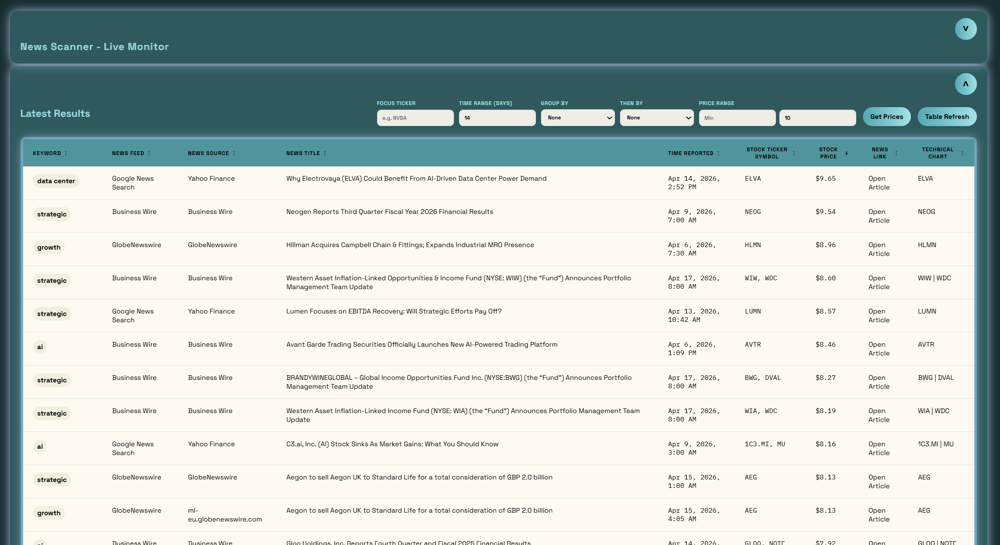
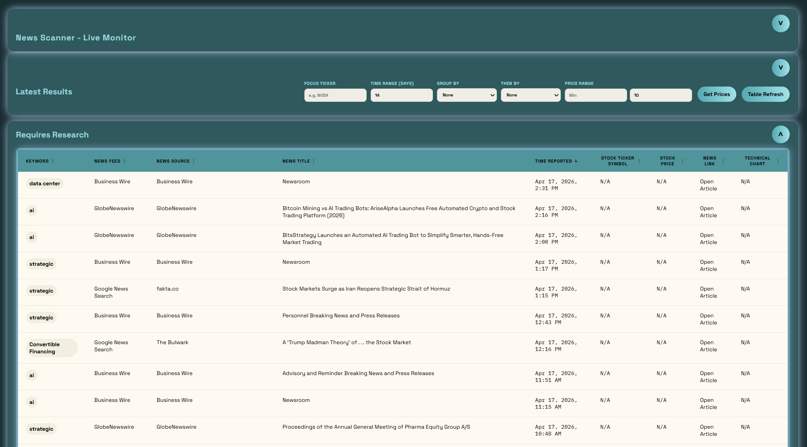

# News Scanner

News Scanner is a single-page market-news dashboard that aggregates RSS results across multiple news providers, filters stories by configurable keywords, and presents the matches in sortable research tables with ticker symbols, optional stock prices, and Finviz chart links.


## Project Overview

The project is designed for quickly scanning live finance-related headlines that match themes you care about, such as `strategic`, `partnership`, `IPO`, `artificial`, or any custom keyword set you enter.

The app has two main parts:

- A Node.js and Express backend that pulls RSS feeds, normalizes articles, applies keyword matching, deduplicates overlapping stories, and performs best-effort ticker extraction.
- A lightweight browser-based frontend that lets you control feeds, keywords, grouping, ticker focus, time range, and price range, then explore the results in two sortable tables.

## What The App Can Do

- Query multiple RSS sources at once from a single dashboard.
- Default to `Google News Search` and `Nasdaq Markets`, with additional feeds available from the feed selector.
- Filter stories by editable keywords separated with `|`.
- Toggle individual keyword chips on and off to filter the main results table without changing the backend query.
- Combine matched stories from selected feeds into one normalized result set.
- Deduplicate repeated stories that appear across sources.
- Split output into:
  - `Latest Results`: rows with detected ticker symbols
  - `Requires Research`: rows where ticker extraction is still `N/A`
- Sort each table independently by:
  - `Keyword`
  - `News Feed`
  - `News Source`
  - `News Title`
  - `Time Reported`
  - `Stock Ticker Symbol`
  - `Stock Price`
  - `News Link`
  - `Technical Chart`
- Extract stock tickers when a headline or article metadata contains recognizable symbols.
- Run a deeper article-level ticker lookup for unresolved stories when the basic patterns fail.
- Build Finviz daily-chart links for detected tickers.
- Load stock prices on demand with the `Get Prices` button.
- Filter the main table by:
  - `Focus Ticker`
  - `Time Range (Days)`
  - `Price Range`
  - `Group By`
  - `Then By`
- Collapse and expand the top panel, `Latest Results`, and `Requires Research`.
- Refresh automatically every 15 minutes.
- Refresh on demand with the `Table Refresh` button.
- Reset all saved UI state with `Page Reset`.

## Feed Sources

The app currently supports these feed providers:

- `Google News Search`
- `GlobeNewswire`
- `Business Wire`
- `Quiver Quantitative`
- `Nasdaq Markets`
- `Nasdaq IPOs`
- `SEC Press Releases`
- `Federal Reserve Press Releases`

Default selection:

- `Google News Search`
- `Nasdaq Markets`

## Page Behavior

When the page loads:

- The app loads the available RSS feeds from the backend.
- The default feed selection is applied automatically.
- The current default keyword list is shown in the text input.
- The main table is populated with stories that already have ticker symbols.
- Unresolved `N/A` ticker rows are moved to the `Requires Research` panel.
- Results sort by newest first unless changed by the user.

While using the page:

- The `News Feeds` dropdown lets you choose one or many feed providers.
- The `Tracked Keywords` input stores the master backend keyword query.
- The keyword chips act as active or inactive filters for the main table only.
- Clicking a chip removes or re-adds that keyword from the rendered `Latest Results` rows without forcing a new fetch.
- Applying a new keyword string resets the active chips to match the updated list.
- The status card shows whether the feed load is live, partial, or failed.
- `Get Prices` is optional and keeps the initial page load faster by delaying quote lookups until requested.
- The `Price Range` controls only narrow the main table after prices have been loaded.
- Each panel can be collapsed independently and remembers its state across reloads.

## Screenshots

Main dashboard:


Top panel collapsed:



Latest Results collapsed:



These views show the current page behavior:

- the default full dashboard with the control surface visible
- the compact top-panel collapsed state with the inline `News Scanner - Live Monitor` label
- the `Latest Results` panel collapsed independently while the rest of the page remains active

## Ticker Detection

Ticker extraction is best-effort. The backend tries several strategies, including:

- Exchange-tag patterns such as `NASDAQ: NVDA`
- Parenthetical ticker patterns such as `Company (NCNO)`
- Dollar-sign patterns such as `$TSLA`
- Postfix and phrasing patterns such as `NECA stock` and `Shares of NECA`
- Company-name lookup using Yahoo Finance search when a headline strongly suggests a company name but not an explicit ticker
- A deeper fallback that fetches article HTML and extracts additional company candidates for unresolved rows

Because news headlines are not standardized, some rows will correctly remain `N/A` when a reliable ticker cannot be inferred.

## Technology Stack

- Runtime: Node.js
- Server: Express
- Feed parsing: `rss-parser`
- Server-side HTTP/data enrichment: native `fetch`, Google News RSS search, Yahoo Finance search/chart endpoints, and Stooq fallback pricing
- Frontend: plain HTML, CSS, and vanilla JavaScript
- Frontend state model: browser-managed state with `localStorage` persistence for keywords, filters, price range, and collapsed panels
- Data source model: RSS feeds fetched server-side, normalized into a single JSON API with query-keyed backend caching

There is no frontend framework, no bundler, and no database in the current project.

## Project Structure

- [server.js](./server.js): Express server, feed adapters, normalization, keyword filtering, ticker extraction, and API routes
- [public/index.html](./public/index.html): page markup
- [public/app.js](./public/app.js): client-side state, rendering, sorting, feed selection, and refresh behavior
- [public/styles.css](./public/styles.css): dashboard styling
- [.env.example](./.env.example): sample runtime configuration

## Running The Project

### Prerequisites

- Node.js 18+ recommended
- npm

### Install Dependencies

```bash
npm install
```

### Optional Environment Setup

You can copy the sample environment file if you want to override defaults:

Windows PowerShell:

```powershell
Copy-Item .env.example .env
```

### Start The App

Production-style start:

```bash
npm start
```

Development mode with automatic restart when `server.js` changes:

```bash
npm run dev
```

Open the app at:

- [http://localhost:3000](http://localhost:3000)

## Stop The App

If the app is running in the current terminal:

- Press `Ctrl + C`

If you started it elsewhere and need to stop the Node process manually in PowerShell:

```powershell
Get-Process node
Stop-Process -Id <PID>
```

## Build Requirements

No build step is required.

This project serves static frontend files directly through Express, so after `npm install` you can run it immediately with `npm start` or `npm run dev`.

## Environment Variables

- `PORT`: server port, default `3000`
- `KEYWORDS`: default keyword list separated by `|`
- `CACHE_TTL_MS`: backend cache duration in milliseconds, default `900000`
- `MAX_ITEM_AGE_DAYS`: maximum article age window used for freshness filtering, default `14`

Current sample defaults are defined in [.env.example](./.env.example).

## API Endpoints

- `GET /api/feeds`
  - returns the available feed providers and the default selected feed ids
- `GET /api/news`
  - returns the normalized news dataset
  - supports `keywords` and `feeds` query parameters using `|` as the separator
  - supports `ageDays`
  - supports `includePrices=true|false`

Example:

```text
/api/news?keywords=IPO|partnership&feeds=google-news|nasdaq-markets&ageDays=14&includePrices=false
```

## Notes

- Some providers may produce zero matches for a given keyword set, which is valid behavior.
- Some official feeds produce broad institutional headlines rather than equity-specific stories.
- Finviz links are only shown when a ticker is detected.
- Google News links may redirect through Google News before landing on the original publisher page.
- Selecting additional feeds may still feel slower on a brand new combination because the backend has to perform fresh RSS fetches and enrichment before that request can be cached.
