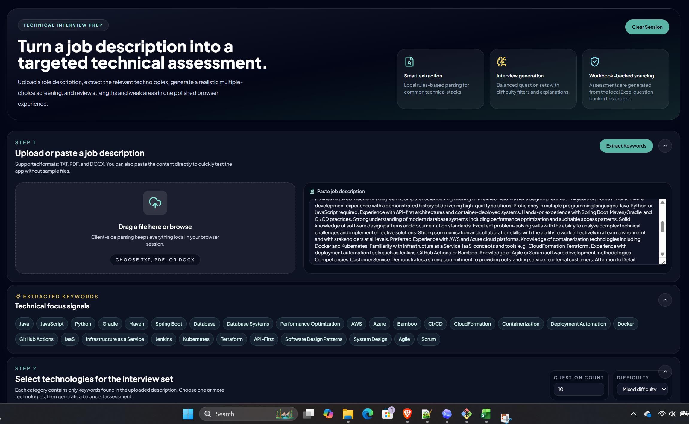
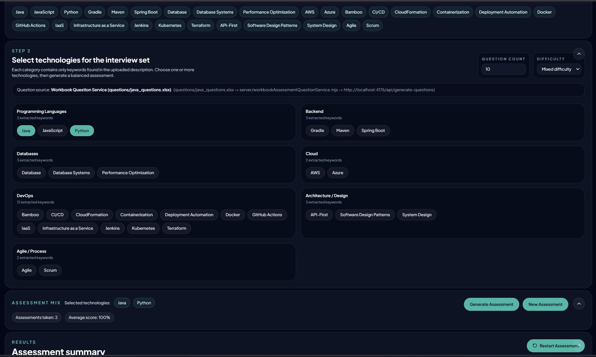
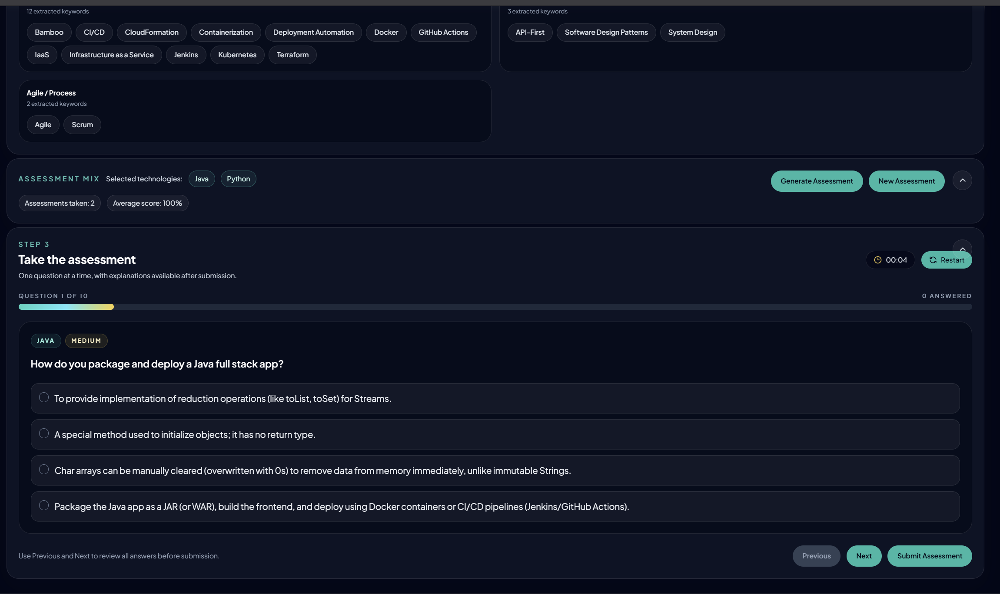
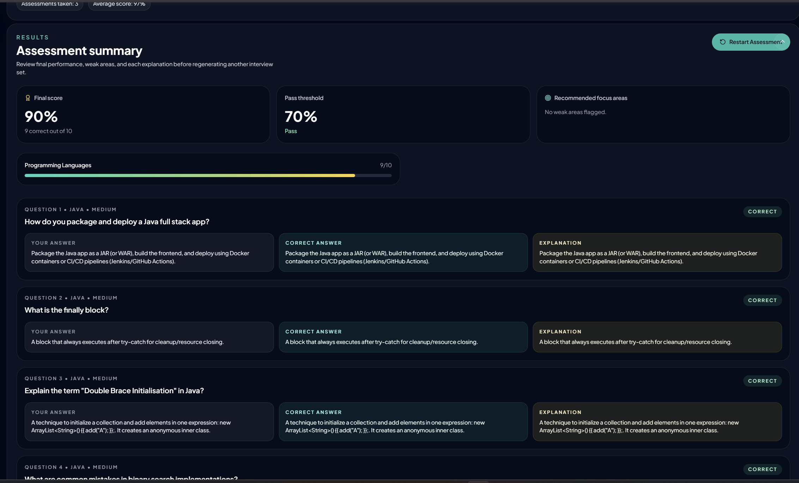

# Technical Assessment by Job Description

## Project Title
Technical Assessment by Job Description

## Project Description
This project is a single-page interview-preparation application that turns a job description into a targeted technical assessment. A user can upload or paste a job description, extract relevant technical keywords, select technologies for practice, generate an assessment, complete the questions, and review results. The current assessment generation flow is workbook-backed, which means technology-specific Excel seed files in the `questions` folder drive the questions and answers used by the application.

## Application Behavior
The application is organized around a practical interview-prep workflow:

1. Upload or paste a job description.
2. Extract technical keywords from that description.
3. Select one or more technologies for the assessment.
4. Generate and complete a technical assessment.
5. Review results and track ongoing performance across multiple assessments.

### Keyword Extraction Screen


This view shows the parsed job-description stage. The user can upload a supported document or paste text, then trigger keyword extraction. The application identifies technical terms such as programming languages, frameworks, databases, and cloud tools, and presents them as grouped chips for downstream assessment setup.

### Technology Selection Screen


This view focuses on assessment setup. After keyword extraction, the user selects the technologies they want included in the interview set, configures question count and difficulty, and reviews the assessment mix. The panel also shows running assessment metrics such as the number of assessments taken and the average score across completed attempts.

### Assessment Generation Screen


This view represents the active assessment experience. Questions are presented one at a time with multiple-choice answers, progress tracking, navigation controls, and a timer. The current assessment source reads workbook seed files from the `questions` folder and uses the matching technology workbook, such as `java_questions.xlsx`, when that technology is selected.

Any Technology and or Keyword Extracted into an Assessment Chip, may or may not require an Excel File with the Questions and Answers that you would like your Generated Assessments built upon.  It is good to check the Projects 'Questions' Folder if the Generated Assessments Error.

### Results Summary Screen


This view summarizes performance after submission. The user sees the final score, pass/fail status, category breakdown, recommended focus areas, and a question-by-question review with the selected answer, correct answer, and explanation. These completed assessments also feed the running average shown in the assessment mix panel.

## Project Stack of Technology
- React 18
- TypeScript
- Vite
- Tailwind CSS
- Express
- `xlsx` for Excel workbook parsing
- `pdfjs-dist` for PDF text extraction
- `mammoth` for DOCX text extraction
- `lucide-react` for iconography
- Browser `localStorage` for session persistence

## How to Build & Run the Project
### Install Dependencies
```bash
npm install
```

### Start the Application
```bash
npm run dev
```

### Local Runtime Ports
- Frontend: `http://localhost:4175`
- Local assessment API: `http://localhost:4176`

### Production Build
```bash
npm run build
npm run preview
```

## Reference Materials Required to Understand the Project
### Key Project Areas
- `src/App.tsx`
  Main application flow and page composition.
- `src/components`
  UI panels for upload, keyword display, technology selection, assessment flow, and results.
- `src/utils/jobDescriptionParser.ts`
  Local parsing logic for extracting technical keywords from job descriptions.
- `src/services/assessmentQuestionService.ts`
  Frontend service that requests assessment questions from the local API.
- `server/index.mjs`
  Local Express API that serves assessment questions.
- `server/workbookAssessmentQuestionService.mjs`
  Workbook-backed question source that reads technology seed files from the `questions` folder.
- `questions`
  Technology-specific Excel seed files, such as `java_questions.xlsx`, used as the assessment question source.

### Seed File Convention
- Workbook files are selected by lowercase technology prefix.
- Example: selecting `Java` uses a workbook prefixed with `java`.
- Example: selecting `Python` uses a workbook prefixed with `python`.
- If no matching workbook exists, the application returns:
  `Unable to Generate Assessment, No Seed File`

### Behavioral Notes
- The application persists in-progress state locally so refresh recovery works during a session.
- Assessment uniqueness is tracked for the first 20 assessment generations before repeats are allowed.
- Assessment history metrics currently include:
  - number of assessments taken
  - average score across completed assessments
